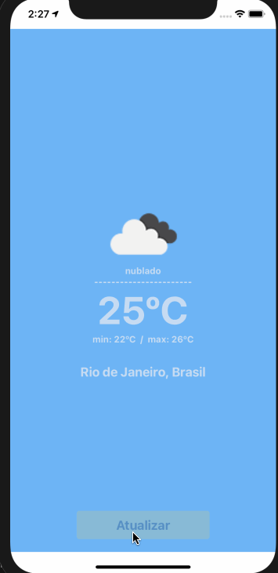
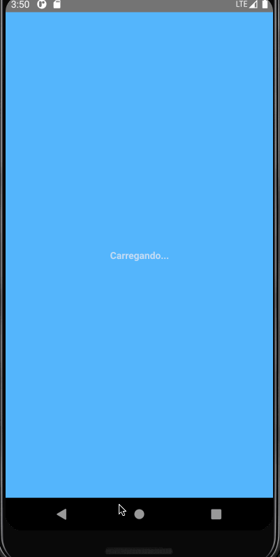

# My Weather App :sun_behind_small_cloud: :cloud_with_rain: :cloud_with_lightning:

An app to show how is going the weather around the user.

<table>
  <tr>
    <th >iOS</th>
    <th>Android</th>
  </tr>
  <tr>
    <td></td>
    <td></td>
  </tr>
</table>

> app that shows how the weather is in the city where the user is, the application was developed for iOS and android using React Native.

## :zap: Prerequisites

- git
- node >= 10.19.0
- yarn
- react-native [environment-setup](https://reactnative.dev/docs/environment-setup)
- xCode / Android Studio

### :hammer_and_wrench: Installing

Clone the repository in a directory of your preference and install all the necessary dependencies for the execution of the project running `yarn install`.

After that, go to `ios` folder and run `pod install`.

### :gear: Running

In the root folder, execute `yarn ios` to run iPhone Simulator or `yarn android` to run Android Simulator.

## :white_check_mark: Running the tests

- `yarn test` to run all tests
- `yarn run test:watch` to run tests and keep watching for changes
- `yarn run test:coverage` to run tests, collect coverage information and serve coverage report as a web page.
